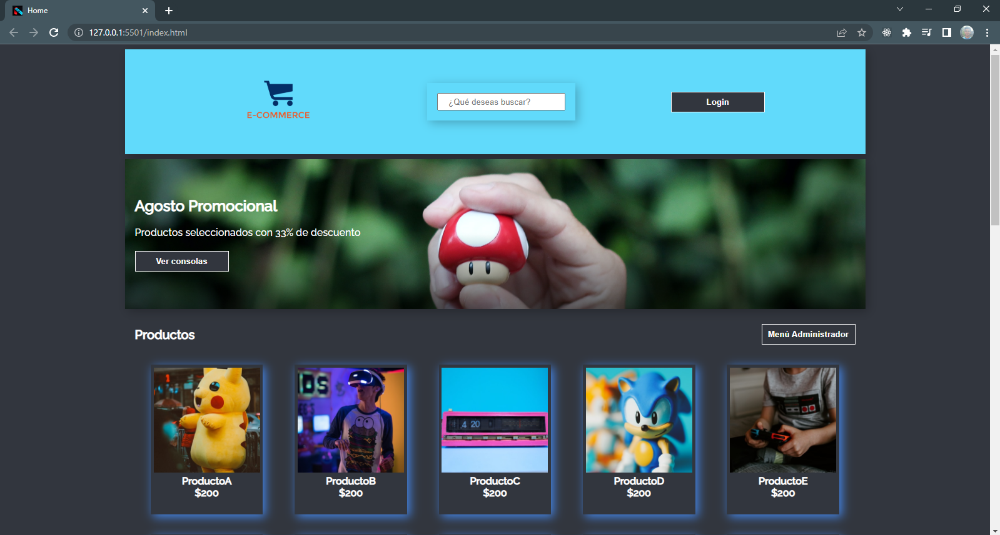
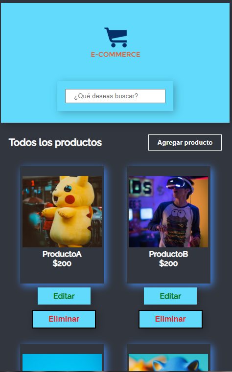
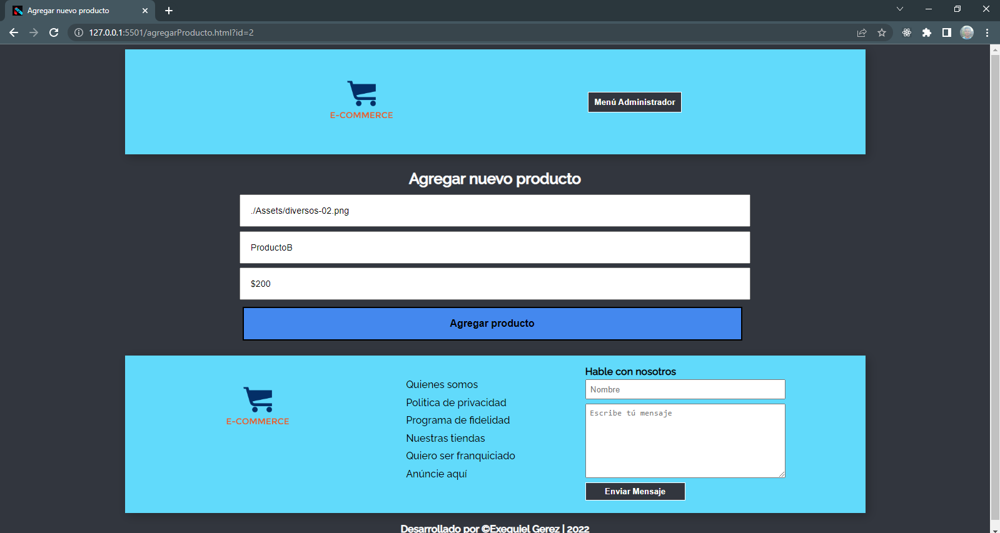
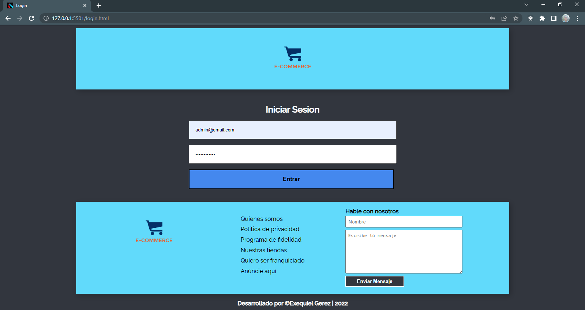

# Proyecto e-ecommerce 🧑‍🔧

Este Proyecto nos permite gestionar nuestros productos como Administrador del e-commerce y el uso/consumo de una api en la cual se almacenan los productos del e-commerce, En el cual me permitio realizar un CRUD de los productos. Ademas de poder filtrar productos por medio de busqueda.

---

## Comandos 🧑‍💻

### Instalar dependencias

npm install

### Api json-server

json-server --watch db.json

---

## Tecnologias utilizadas:

##    

---

## Datos de login

#### Correo: admin@email.com
#### Contraseña: administrador

---

---

---

---

---

